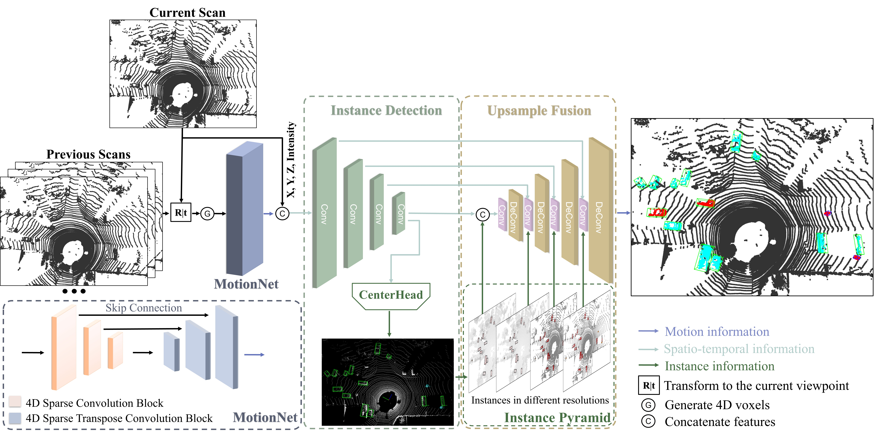

# InsMOS: Instance-Aware Moving Object Segmentation in LiDAR Data

This repo contains the code  for our paper:

> **InsMOS: Instance-Aware Moving Object Segmentation in LiDAR Data **                                                                                                                                                                                                                                                                                    Neng Wang,  [Chenghao Shi](https://github.com/chenghao-shi),  Ruibin Guo,  Huimin Lu,  Zhiqiang Zheng,  [Xieyuanli Chen](https://github.com/Chen-Xieyuanli)                                                                                                                                                      *arXiv technical report ([[arXiv 2303.03909](https://arxiv.org/abs/2303.03909)])*

- *Our instance-aware moving object segmentation on the SemanticKITTI sequence 08 and 20, 21.*

- *Red points are predicted as moving, and cyan are predicted as static instance points.*

- *Green bounding boxes represent cars, blue bounding boxes represent pedestrians, and yellow bounding boxes represent cyclists.*

## Overview

*Overview of our network. MotionNet mainly extracts motion features. Instance Detection Module extracts spatio-temporal features and detects instances. Upsample Fusion Module is applied to fuse the spatio-temporal and instance features, and predict point-wise moving confidence scores.*

## Data

1、Semantic-KITTI: Download Semantic-KITTI dataset from the official [website](http://semantic-kitti.org/). 

2、KITTI-road Dataset: Download the KITTI-road Velodyne point clouds from the official [website](https://www.cvlibs.net/datasets/kitti/raw_data.php?type=road) and MOS label from [MotionSeg3D](https://github.com/haomo-ai/MotionSeg3D).

3、Instance label: [coming soon].

## Code

To be released soon.

## Contact

Any question or suggestions are welcome!

Neng Wang: nwang@nudt.edu.cn

## License

This project is free software made available under the MIT License. For details see the LICENSE file.

